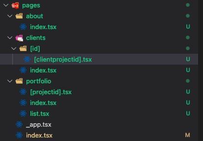
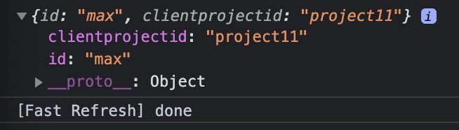

# Next.js & React

<a href="https://nextjs.org/"></a> <a href="https://reactjs.org/"><a href="https://www.typescriptlang.org/"></a> </a>

A workspace for the Udemy course, [Next.js & React - The Complete Guide](https://www.udemy.com/course/nextjs-react-the-complete-guide/) using a custom TypeScript setting (the course is conducted using JS)

---

## Development Note 🟡

## Installation (TypeScript specific)

1. Download [Node.js](https://nodejs.org/en/)

2. Initialize Next.js app with `npx`

   ```shell
   npx create-next-app PROJECT_NAME
   ```

3. Create an empty `tsconfig.json` file in the root of your project

   ```shell
   touch tsconfig.json
   ```

   Next.js will automatically configure this file with default values. Providing your own `tsconfig.json` with custom compiler options is also supported

   > Next.js uses Babel to handle TypeScript, which has some caveats, and some compiler options are handled differently.

4. Then, run next (normally `npm run dev` or `yarn dev`)

5. You're now ready to start converting files from .js to .tsx and leveraging the benefits of TypeScript!

**Course Outline**


---

## Structure

### Routing


---

### `useRouter`

```typescript
import { NextRouter, useRouter } from 'next/router';

const PortfolioProjectPage: React.FC = (): JSX.Element => {
  const router: NextRouter = useRouter();

  // print "/portfolio/[filename]"
  console.log('router.pathname:', router.pathname);
  // print "{projectid: "your-parameter"}
  console.log('router.query:', router.query);
  // print "/portfolio/your-parameter
  console.log('router.asPath:', router.asPath);

  return (
    <div>
      <h1>The Portfolio Project Page</h1>
    </div>
  );
};

export default PortfolioProjectPage;
```

Check out more usage in the [documentation](https://nextjs.org/docs/api-reference/next/router)

---

## Building Nested Dynamic Routes

File Structure</br>


`pages/clients/[id]/[clientprojectid].tsx`</br>

```typescript
// pages/clients/[id]/[clientprojectid].tsx
import { useRouter, NextRouter } from 'next/router';

const SelectedClientProjectPage: React.FC = (): JSX.Element => {
  const router: NextRouter = useRouter();

  console.log(router.query); // Here's console.log

  return (
    <div>
      <h1>SelectedClientProjectPage</h1>
    </div>
  );
};

export default SelectedClientProjectPage;
```

Console Output on `http://localhost:3000/clients/max/project11`</br>


We can use all theses files names and structure as a router structure. 👍

---

## Catch-All Routes

1. Create `blog/` dir in `pages/` dir, create a file named `[...something].tsx`

2. `localhost:3000/blog/ANYTHING/FROM/HERE/IS/CAUGHT` in `router.query` as:

   ```console
   { something: ["ANYTHING", "FROM", "HERE", "IS", "CAUGHT"]
     __proto__: Object
   ```

3. You can utilize it

---

## Navigate with "Link" Component

```typescript
// index.tsx
import Link from 'next/link';

const HomePage: React.FC = (): JSX.Element => {
  return (
    <div>
      <h1>The Home Page</h1>
      <ul>
        <li>
          <Link href='/portfolio'>Portfolio</Link>
        </li>
        <li>
          <Link href='/clients'>Clients</Link>
        </li>
      </ul>
    </div>
  );
};

export default HomePage;
```
